```plantuml
@startuml
set separator none
title Internet Banking System - Deployment - Live

top to bottom direction

!include <C4/C4>
!include <C4/C4_Context>
!include <C4/C4_Container>
!include <C4/C4_Deployment>

Deployment_Node(BigBankPlc.Environments.Live.Nodes.CustomerMobileDevice, "Customer's mobile device", $type="Apple iOS or Android", "") {
  Container(BigBankPlc.Environments.Live.Nodes.CustomerMobileDevice.Deployments.BigBankPlc.SoftwareSystems.InternetBanking.Containers.MobileApp, "Mobile App", "Xamarin", "Provides a limited subset of the Internet banking functionality to customers via their mobile device.")
}

Deployment_Node(BigBankPlc.Environments.Live.Nodes.CustomersComputer, "Customer's computer", $type="Microsoft Windows or Apple macOS", "") {
  Deployment_Node(BigBankPlc.Environments.Live.Nodes.CustomersComputer.Nodes.WebBrowser, "Web Browser", $type="Chrome, Firefox, Safari, or Edge", "") {
    Container(BigBankPlc.Environments.Live.Nodes.CustomersComputer.Nodes.WebBrowser.Deployments.BigBankPlc.SoftwareSystems.InternetBanking.Containers.SinglePageApp, "Single-Page Application", "JavaScript, Angular", "Provides all of the Internet banking functionality to customers via their web browser.")
  }
}

Deployment_Node(BigBankPlc.Environments.Live.Nodes.BigBankPlc, "Big Bank plc", $type="Big Bank plc data center", "") {
  Deployment_Node(BigBankPlc.Environments.Live.Nodes.BigBankPlc.Nodes.BigBankWeb, "bigbank-web*** (x4)", $type="Ubuntu 16.04 LTS", "") {
    Deployment_Node(BigBankPlc.Environments.Live.Nodes.BigBankPlc.Nodes.BigBankWeb.Nodes.ApacheTomcat, "Apache Tomcat", $type="Apache Tomcat 8.x", "") {
      Container(BigBankPlc.Environments.Live.Nodes.BigBankPlc.Nodes.BigBankWeb.Nodes.ApacheTomcat.Deployments.BigBankPlc.SoftwareSystems.InternetBanking.Containers.WebApplication, "Web Application", "Java, Spring MVC", "Delivers the static content and the Internet banking single page application.")
    }
  }

  Deployment_Node(BigBankPlc.Environments.Live.Nodes.BigBankPlc.Nodes.BigBankApi, "bigbank-api*** (x8)", $type="Ubuntu 16.04 LTS", "") {
    Deployment_Node(BigBankPlc.Environments.Live.Nodes.BigBankPlc.Nodes.BigBankApi.Nodes.ApacheTomcat, "Apache Tomcat", $type="Apache Tomcat 8.x", "") {
      Container(BigBankPlc.Environments.Live.Nodes.BigBankPlc.Nodes.BigBankApi.Nodes.ApacheTomcat.Deployments.BigBankPlc.SoftwareSystems.InternetBanking.Containers.APIApplication, "API Application", "Java, Spring MVC", "Provides Internet banking functionality via a JSON/HTTPS API.")
    }
  }

  Deployment_Node(BigBankPlc.Environments.Live.Nodes.BigBankPlc.Nodes.BigBankDb01, "bigbank-db01", $type="Ubuntu 16.04 LTS", "") {
    Deployment_Node(BigBankPlc.Environments.Live.Nodes.BigBankPlc.Nodes.BigBankDb01.Nodes.PrimaryDatabaseServer, "Oracle - Primary", $type="Oracle 12c", "") {
      ContainerDb(BigBankPlc.Environments.Live.Nodes.BigBankPlc.Nodes.BigBankDb01.Nodes.PrimaryDatabaseServer.Deployments.BigBankPlc.SoftwareSystems.InternetBanking.Containers.Database, "Database", "Oracle Database Schema", "Stores user registration information, hashed authentication credentials, access logs, etc.")
    }
  }

  Deployment_Node(BigBankPlc.Environments.Live.Nodes.BigBankPlc.Nodes.BigBankDb02, "bigbank-db02", $type="Ubuntu 16.04 LTS", "") {
    Deployment_Node(BigBankPlc.Environments.Live.Nodes.BigBankPlc.Nodes.BigBankDb02.Nodes.SecondaryDatabaseServer, "Oracle - Secondary", $type="Oracle 12c", "") {
      ContainerDb(BigBankPlc.Environments.Live.Nodes.BigBankPlc.Nodes.BigBankDb02.Nodes.SecondaryDatabaseServer.Deployments.BigBankPlc.SoftwareSystems.InternetBanking.Containers.Database, "Database", "Oracle Database Schema", "Stores user registration information, hashed authentication credentials, access logs, etc.")
    }
  }

  Deployment_Node(BigBankPlc.Environments.Live.Nodes.BigBankPlc.Nodes.BigBankProd001, "bigbank-prod001", $type="", "") {
    System(BigBankPlc.Environments.Live.Nodes.BigBankPlc.Nodes.BigBankProd001.Deployments.BigBankPlc.SoftwareSystems.MainframeBankingSystem, "Mainframe Banking System", "Stores all of the core banking information about customers, accounts, transactions, etc.")
  }

  Deployment_Node(BigBankPlc.Environments.Live.Nodes.BigBankPlc.Nodes.LoadBalancer, "Load Balancer", $type="", "") {
   
  }
}

Rel(BigBankPlc.Environments.Live.Nodes.BigBankPlc.Nodes.BigBankWeb.Nodes.ApacheTomcat.Deployments.BigBankPlc.SoftwareSystems.InternetBanking.Containers.WebApplication, BigBankPlc.Environments.Live.Nodes.CustomersComputer.Nodes.WebBrowser.Deployments.BigBankPlc.SoftwareSystems.InternetBanking.Containers.SinglePageApp, "Load And Start", "HTTPS", $tags='protocol:https')
Rel(BigBankPlc.Environments.Live.Nodes.CustomerMobileDevice.Deployments.BigBankPlc.SoftwareSystems.InternetBanking.Containers.MobileApp, BigBankPlc.Environments.Live.Nodes.BigBankPlc.Nodes.LoadBalancer, "Sign In\nChange Password\nGet Customer\nGet Customer Accounts\nGet Account Transactions", "HTTPS", $tags='protocol:https')
Rel(BigBankPlc.Environments.Live.Nodes.CustomersComputer.Nodes.WebBrowser.Deployments.BigBankPlc.SoftwareSystems.InternetBanking.Containers.SinglePageApp, BigBankPlc.Environments.Live.Nodes.BigBankPlc.Nodes.LoadBalancer, "Sign In\nChange Password\nGet Customer\nGet Customer Accounts\nGet Account Transactions\nCreate Account", "HTTPS", $tags='protocol:https')
Rel(BigBankPlc.Environments.Live.Nodes.BigBankPlc.Nodes.LoadBalancer, BigBankPlc.Environments.Live.Nodes.BigBankPlc.Nodes.BigBankApi.Nodes.ApacheTomcat.Deployments.BigBankPlc.SoftwareSystems.InternetBanking.Containers.APIApplication, "Sign In\nChange Password\nGet Customer\nGet Customer Accounts\nGet Account Transactions\nCreate Account", "HTTPS", $tags='protocol:https')
Rel(BigBankPlc.Environments.Live.Nodes.BigBankPlc.Nodes.BigBankApi.Nodes.ApacheTomcat.Deployments.BigBankPlc.SoftwareSystems.InternetBanking.Containers.APIApplication, BigBankPlc.Environments.Live.Nodes.BigBankPlc.Nodes.BigBankDb01.Nodes.PrimaryDatabaseServer.Deployments.BigBankPlc.SoftwareSystems.InternetBanking.Containers.Database, "Authenticate User\nUpdate User Password", "TCP/IP, SQL", $tags='protocol:tcp/ip, sql')
Rel(BigBankPlc.Environments.Live.Nodes.BigBankPlc.Nodes.BigBankApi.Nodes.ApacheTomcat.Deployments.BigBankPlc.SoftwareSystems.InternetBanking.Containers.APIApplication, BigBankPlc.Environments.Live.Nodes.BigBankPlc.Nodes.BigBankDb02.Nodes.SecondaryDatabaseServer.Deployments.BigBankPlc.SoftwareSystems.InternetBanking.Containers.Database, "Authenticate User\nUpdate User Password", "TCP/IP, SQL", $tags='protocol:tcp/ip, sql')
Rel(BigBankPlc.Environments.Live.Nodes.BigBankPlc.Nodes.BigBankApi.Nodes.ApacheTomcat.Deployments.BigBankPlc.SoftwareSystems.InternetBanking.Containers.APIApplication, BigBankPlc.Environments.Live.Nodes.BigBankPlc.Nodes.BigBankProd001.Deployments.BigBankPlc.SoftwareSystems.MainframeBankingSystem, "Get Customer\nGet Customer Accounts\nGet Account Transactions\nCreate Account", "XML/HTTPS", $tags='protocol:xml/https')
Rel(BigBankPlc.Environments.Live.Nodes.BigBankPlc.Nodes.BigBankDb01.Nodes.PrimaryDatabaseServer, BigBankPlc.Environments.Live.Nodes.BigBankPlc.Nodes.BigBankDb02.Nodes.SecondaryDatabaseServer, "Replicates Data", "")

SHOW_LEGEND(true)
@enduml
```

# Add support for Infrastructure Architecture as Code and Deployment Diagrams generation

Below are some design and implementation details for [Issue #62](https://github.com/SlavaVedernikov/C4InterFlow/issues/62).

## Proposed structure for Infrastructure (Deployment) Architecture as Code

- `Environments` token denotes the `object` that would contains Deployment Architecture
  - `Environments` token must be located under a `Namespace` object in the same way as `SoftwareSystems` and `BusinessProcesses` tokens are.
    - **NOTE**: `Namespaces` can be nested
  - `Environments` object has a property of `object` type per deployment environment e.g. `Development`, `Live` etc.  
    - Each deployment environment `object` has `Nodes` property of `object` type
      - `Nodes` object has a property of `object` type per `Node`
        - `Node` object has the following properties
          - `Label` (optional)
            - If not provided, it will be inferred from Node object property itself
          - `Type` (optional)
          - `Nodes` (optional)
            - Has a property of `object` type per `Node`
          - `Deployments` (optional)
            - Array of `Aliases` of `string` type pointing to the `Structures` in AaC (e.g. `SoftwareSystems` or `Conteiners`) that are deployed at the current `Node`
          - `Interfaces` (optional) - **Can be added at a later stage**
            - `Interfaces` object has a property of `object` type per `Interface` (same as in `SoftwareSystem`, `Container` and `Component` objects)
            - `Interfaces` and `Flows` can be used to establish relationships between deployment `Nodes` when drawing `Deployment` diagrams

    - Deployment environment `object` may have `Routes` property of `Array` type  - **Can be added at a later stage**
      - `Route` object has the following properties
        - `From` (required)
          - JSON Path to the `Interfaces` from which the `Use` flows should be routed
        - `Via` (required)
          - `Alias` of the `Node` that the requests would be routed through
        - `To` (required)
          - JSON Path to the `Interfaces` to which this routing applies

## Examples

The following examples are based on the [Internet Banking System - YAML](../../Samples/Internet%20Banking%20System/Yaml/Architecture/SoftwareSystems) sample AaC

### Development environment

**Given** the following **Development** environment Deployment Architecture

```yaml
BigBankPlc:
  Environments:
    Development:
      Nodes:
        DeveloperLaptop:
          Type: Microsoft Windows 10 or Apple macOS
          Nodes:
            WebBrowser:
              Type: Chrome, Firefox, Safari, or Edge
              Deployments:
              - BigBankPlc.SoftwareSystems.InternetBanking.Containers.SinglePageApp
            DockerContainerWebServer:
              Label: Docker Container - Web Server
              Type: Docker
              Nodes:
                ApacheTomcat:
                  Type: Apache Tomcat 8.x
                  Deployments:
                  - BigBankPlc.SoftwareSystems.InternetBanking.Containers.WebApplication
                  - BigBankPlc.SoftwareSystems.InternetBanking.Containers.APIApplication
            DockerContainerDatabaseServer:
              Type: Docker
              Label: Docker Container - Database Server
              Nodes:
                DatabaseServer:
                  Type: Oracle 12c
                  Deployments:
                  - BigBankPlc.SoftwareSystems.InternetBanking.Containers.Database
        BigBankPlc:
          Label: Big Bank plc
          Type: Big Bank plc data center
          Nodes:
            BigBankDev001:
              Deployments:
              - BigBankPlc.SoftwareSystems.MainframeBankingSystem

```

**When** `draw-diagrams` command is executed with `--type c4-deployment`

**Then** the following PlantUML content should be generated

```plantuml
@startuml
!include ..\..\..\.c4s\C4_Container.puml
!include ..\..\..\.c4s\C4_Deployment.puml

title Big Bank Plc - Development - C4 Deployment - Container level

Deployment_Node(BigBankPlc.Environments.Development.Nodes.DeveloperLaptop, "Developer Laptop", $type="Microsoft Windows 10 or Apple macOS", "") {
  Deployment_Node(BigBankPlc.Environments.Development.Nodes.DeveloperLaptop.Nodes.WebBrowser, "Web Browser", $type="Chrome, Firefox, Safari, or Edge", "") {
    Container(BigBankPlc.Environments.Development.Nodes.DeveloperLaptop.Nodes.WebBrowser.Deployments.BigBankPlc.SoftwareSystems.InternetBanking.Containers.SinglePageApp, "Single-Page Application", "JavaScript, Angular", "Provides all of the Internet banking functionality to customers via their web browser.")
  }

  Deployment_Node(BigBankPlc.Environments.Development.Nodes.DeveloperLaptop.Nodes.DockerContainerWebServer, "Docker Container - Web Server", $type="Docker", "") {
    Deployment_Node(BigBankPlc.Environments.Development.Nodes.DeveloperLaptop.Nodes.DockerContainerWebServer.Nodes.ApacheTomcat, "Apache Tomcat", $type="Apache Tomcat 8.x", "") {
      Container(BigBankPlc.Environments.Development.Nodes.DeveloperLaptop.Nodes.DockerContainerWebServer.Nodes.ApacheTomcat.Deployments.BigBankPlc.SoftwareSystems.InternetBanking.Containers.WebApplication, "Web Application", "Java, Spring MVC", "Delivers the static content and the Internet banking SPA")
      Container(BigBankPlc.Environments.Development.Nodes.DeveloperLaptop.Nodes.DockerContainerWebServer.Nodes.ApacheTomcat.Deployments.BigBankPlc.SoftwareSystems.InternetBanking.Containers.APIApplication, "API Application", "Java, Spring MVC", "Provides Internet banking functionality via API")
    }
  }

  Deployment_Node(BigBankPlc.Environments.Development.Nodes.DeveloperLaptop.Nodes.DockerContainerDatabaseServer, "Docker Container - Database Server", $type="Docker", "") {
    Deployment_Node(BigBankPlc.Environments.Development.Nodes.DeveloperLaptop.Nodes.DockerContainerDatabaseServer.Nodes.DatabaseServer, "Database Server", $type="Oracle 12c", "") {
      ContainerDb(BigBankPlc.Environments.Development.Nodes.DeveloperLaptop.Nodes.DockerContainerDatabaseServer.Nodes.DatabaseServer.Deployments.BigBankPlc.SoftwareSystems.InternetBanking.Containers.Database, "Database", "Oracle Database Schema", "Stores user registration information, hashed authentication credentials, access logs, etc.")
    }
  }
}

Deployment_Node(BigBankPlc.Environments.Development.Nodes.BigBankPlc, "Big Bank plc", $type="Big Bank plc data center", "") {
  Deployment_Node(BigBankPlc.Nodes.BigBankDev001, "bigbank-dev001", $type="", "") {
    System(BigBankPlc.Environments.Development.Nodes.BigBankPlc.Nodes.BigBankDev001.Deployments.BigBankPlc.SoftwareSystems.MainframeBankingSystem, "Mainframe Banking System", "Stores all of the core banking information about customers, accounts, transactions, etc.")
  }
}

Rel(BigBankPlc.Environments.Development.Nodes.DeveloperLaptop.Nodes.DockerContainerWebServer.Nodes.ApacheTomcat.Deployments.BigBankPlc.SoftwareSystems.InternetBanking.Containers.WebApplication, BigBankPlc.Environments.Development.Nodes.DeveloperLaptop.Nodes.WebBrowser.Deployments.BigBankPlc.SoftwareSystems.InternetBanking.Containers.SinglePageApp, "Load And Start", "HTTPS", $tags='protocol:https')
Rel(BigBankPlc.Environments.Development.Nodes.DeveloperLaptop.Nodes.WebBrowser.Deployments.BigBankPlc.SoftwareSystems.InternetBanking.Containers.SinglePageApp, BigBankPlc.Environments.Development.Nodes.DeveloperLaptop.Nodes.DockerContainerWebServer.Nodes.ApacheTomcat.Deployments.BigBankPlc.SoftwareSystems.InternetBanking.Containers.APIApplication, "Sign In\nChange Password\nGet Customer\nGet Customer Accounts\nGet Account Transactions\nCreate Account", "HTTPS", $tags='protocol:https')
Rel(BigBankPlc.Environments.Development.Nodes.DeveloperLaptop.Nodes.DockerContainerWebServer.Nodes.ApacheTomcat.Deployments.BigBankPlc.SoftwareSystems.InternetBanking.Containers.APIApplication, BigBankPlc.Environments.Development.Nodes.DeveloperLaptop.Nodes.DockerContainerDatabaseServer.Nodes.DatabaseServer.Deployments.BigBankPlc.SoftwareSystems.InternetBanking.Containers.Database, "Authenticate User\nUpdate User Password", "TCP/IP, SQL", $tags='protocol:tcp/ip, sql')
Rel(BigBankPlc.Environments.Development.Nodes.DeveloperLaptop.Nodes.DockerContainerWebServer.Nodes.ApacheTomcat.Deployments.BigBankPlc.SoftwareSystems.InternetBanking.Containers.APIApplication, BigBankPlc.Environments.Development.Nodes.BigBankPlc.Nodes.BigBankDev001.Deployments.BigBankPlc.SoftwareSystems.MainframeBankingSystem, "Get Customer\nGet Customer Accounts\nGet Account Transactions\nCreate Account", "XML/HTTPS", $tags='protocol:xml/https')

SHOW_LEGEND(true)
@enduml
```


### Live environment

**Given** the following **Live** environment Deployment Architecture

```yaml
BigBankPlc:
  Environments:
    Live:
      Nodes:
        CustomerMobileDevice:
          Label: Customer's mobile device
          Type: Apple iOS or Android
          Deployments:
          - BigBankPlc.SoftwareSystems.InternetBanking.Containers.MobileApp
        CustomersComputer:
          Label: Customer's computer
          Type: Microsoft Windows or Apple macOS
          Nodes:
            WebBrowser:
              Type: Chrome, Firefox, Safari, or Edge
              Deployments:
              - BigBankPlc.SoftwareSystems.InternetBanking.Containers.SinglePageApp
        BigBankPlc:
          Label: Big Bank plc
          Type: Big Bank plc data center
          Nodes:
            BigBankWeb:
              Label: bigbank-web***
              Type: Ubuntu 16.04 LTS
              NumberOfInstances: 4
              Nodes:
                ApacheTomcat:
                  Type: Apache Tomcat 8.x
                  Deployments:
                  - BigBankPlc.SoftwareSystems.InternetBanking.Containers.WebApplication
            BigBankApi:
              Label: bigbank-api***
              Type: Ubuntu 16.04 LTS
              NumberOfInstances: 8
              Nodes:
                ApacheTomcat:
                  Type: Apache Tomcat 8.x
                  Deployments:
                  - BigBankPlc.SoftwareSystems.InternetBanking.Containers.APIApplication
            BigBankDb01:
              Label: bigbank-db01
              Type: Ubuntu 16.04 LTS
              Interfaces:
                ReplicateData:
                  Flows:
                  - Type: Use
                    Expression: BigBankDb02.Interfaces.ReplicateData
              Nodes:
                PrimaryDatabaseServer:
                  Label: Oracle - Primary
                  Type: Oracle 12c
                  Deployments:
                  - BigBankPlc.SoftwareSystems.InternetBanking.Containers.Database
            BigBankDb02:
              Label: bigbank-db02
              Type: Ubuntu 16.04 LTS
              Nodes:
                SecondaryDatabaseServer:
                  Label: Oracle - Secondary
                  Type: Oracle 12c
                  Deployments:
                  - BigBankPlc.SoftwareSystems.InternetBanking.Containers.Database
              Interfaces:
                ReplicateData: {}
            BigBankProd001:
              Deployments:
              - BigBankPlc.SoftwareSystems.MainframeBankingSystem
            LoadBalancer: {}
      Routes:
      - From: BigBankPlc.SoftwareSystems.InternetBanking.Containers.SinglePageApp.Interfaces.*
        Via: BigBankPlc.Environments.Live.Nodes.BigBankPlc.Nodes.LoadBalancer
        To: BigBankPlc.SoftwareSystems.InternetBanking.Containers.APIApplication.Interfases.*
      - From: BigBankPlc.SoftwareSystems.InternetBanking.Containers.MobileApp.Interfaces.*
        Via: BigBankPlc.Environments.Live.Nodes.BigBankPlc.Nodes.LoadBalancer
        To: BigBankPlc.SoftwareSystems.InternetBanking.Containers.APIApplication.Interfases.*
```

**When** `draw-diagrams` command is executed with `--type c4-deployment`

**Then** the following PlantUML content should be generated


